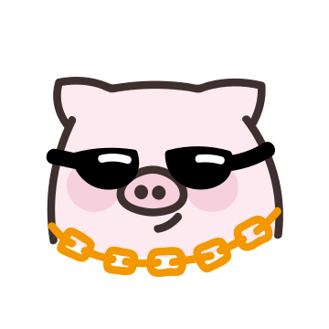
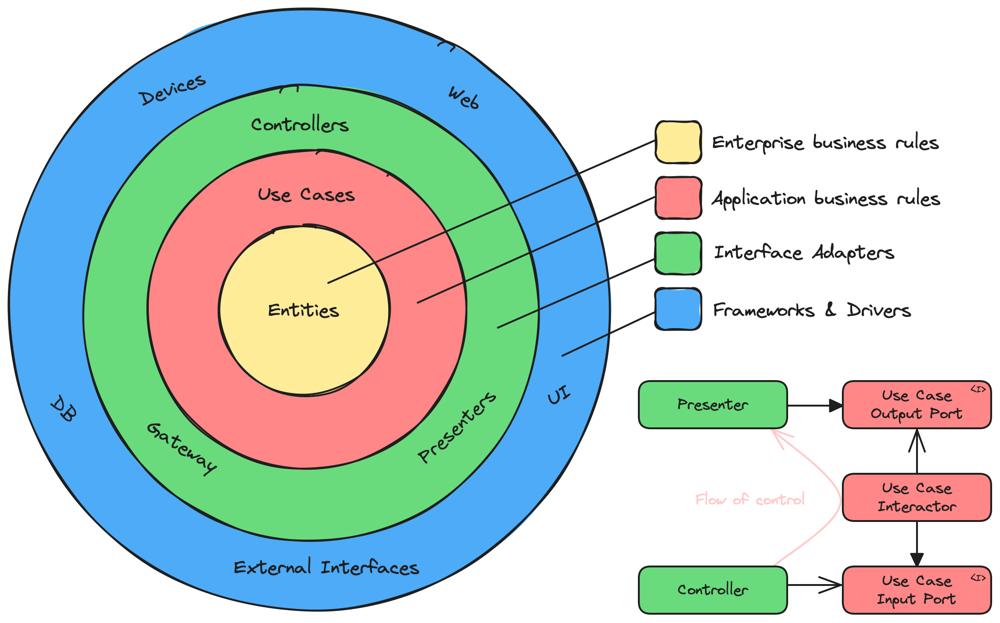

# Solution Architect

* Đăng Kiều
  (Solution Architect)
  * Architecture
    * Micro service
      * Clean architect
        * Focus business
      * Backend for Frontend
  * NextJs
    * App router
    * React server component
      * No use fetch in useEffect
    * SSR default
    * SSR + Static site generation
    * Server funtion in component
    * Middleware
      * Caching
      * Redirect
      * Auth
      * Tracking
    * Turbo pack
  * DevOps
    * K8s
      * configation management
        * Helm
          * Reuse chart
        * Kustomize
          * Compose config file
          * Base & overlay
            * Steps
              * kube kustomize
                kubectl apply -k base
                kubectl rollout restart
      * Istio
        * Destination Rule
          * Load balancing
            mTLS
            Subnet
            Time out
            Retry
            Divide traffic version
        * Virtual Service
          * Carnary deploy
            Mirroring
            Fault Infection
            Limite rate
            Control trafic way
        * Gate way
          * Inbound trafic
    * Terraform
      * Control VPS
    * Pipeline
      * CI
        * Gitlab
        * Test
        * Build image
        * Push image
      * CD
        * Argo CD
          * Deploy
            * Control K8s config
          * How to rollback
            * Git revert
  * Backend
    * NextJS
      * Why need to micro service?
        * Support
          * CORS
          * Kafka
          * gRPC
          * Redis
          * Web socket
        * Event Driven Architect
        * DI dễ quản service
        * Dễ scale horizontal
      * Decorations
      * Dependency injection
      * Moduler
      * Config
      * Controller
      * Module
      * Provider
      * Middleware
      * Guard
        * Pipe
        * Intercaptors
  * 10 years Experiences
    * Head of engineer
      * Build core
        * Function
        * Automation
      * Build team
    * Teamsize 30+
      * Kanban
      * Jira
      * Discord
    * E-commerce
      * Sell
      * Venue
        * Event
        * Company
        * Wedding
      * Customer
      * Supplier
      * Agent
  * Mỗi service domain riêng
    * Quản lý
      * Event Driven
      * Change data capture
      * GraphQL
    * Nên để chung khi
      * Thường xuyên join
        ACID mạnh
        DepOps không mạnh
        To small data
    * Nên tách khi
      * Không cần join
        Tự scale riêng
        Có DB riêng
        Bảo mật riêng
        Giảm phụ thuộc

Rect, with text label ""

Diamond, with text label "Diamondset"

Diamond, with text label "Deployment"

Diamond, with text label ""

Diamond, with text label "Config map"

Rect, with text label ""

Rect, with text label "K8s
Control
Plane"

Ellipse, with text label "TERRAFORM CLOUD"

Rect, with text label "Kafka"

Rect, with text label "Helm"

Rect, with text label "Nginx Ingress"

Rect, with text label "Nginx Load Balance"

Rect, with text label "Grafana
Prom etheus"

Ellipse, with text label "User"

Rect, with text label "Gitlab repo"

Rect, with text label ""

Rect, with text label "Gitlab Runner"

Connector, with text label "Push (1)"

Connector, with text label "Trigger CI (Pull code) (2)"

Ellipse, with text label "Mongo"

Ellipse, with text label "PostgreSQL"

Connector, with text label "Feature Flags"

Rect, with text label "Gitlab Registry"

Connector, with text label "(3)"

Connector, with text label "(4)"

Connector, with text label "(5)"

Connector, with text label "Trigger CI (6)"

Rect, with text label "Gitlab Repo"

Connector, with text label "(7)"

Rect, with text label "Argo CD"

Connector, with text label "Push tag version & trigger CD"

Connector, with text label "Deploy K8s State (8)"

Connector, with text label "Pull Image (9)"

